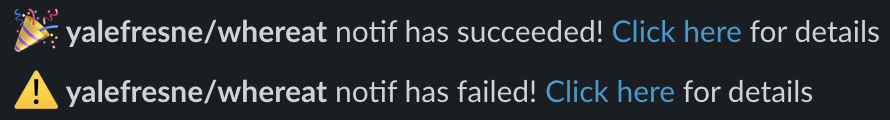

# slack-notification-action 💬 
Github action for sending notification on a Slack channel about CI/CD workflow.  
**Requirement**:
You must have a [Slack Incoming Webhooks](https://api.slack.com/messaging/webhooks) configured to use this action.

## Input variables

See [action.yml](./action.yml) for more detailed information.

* `webhook_slack` - Your Incoming Webhook URL
* `channel_name` - Slack channel's name where the message will be posted
* `build_status` - Build job's status
* `deploy_status` - Deploy job's status
* `branch_name` - To send notification only for a specific branch (Optionnal)

## More informations
`webhook_slack` : Your Incoming Webhook URL must not be publicly exposed, so store it in a [secret github](https://docs.github.com/en/actions/reference/encrypted-secrets).  
`channel_name`: On recent version of Incoming Webhook, this varable has no effect.

## Example usage

```yaml
jobs:
  build:
    runs-on: ubuntu-latest
    outputs:
      status: ${{ job.status }}

    steps:
      - uses: actions/checkout@v2

# ...

  deploy:
    runs-on: ubuntu-latest
    needs: build
    outputs:
      status: ${{ job.status }}

    steps:
      - uses: actions/checkout@v2

# ...

  notification:
    needs: [build, deploy]
    if: always()
    runs-on: ubuntu-latest
    steps:
    - name: Send Notification
      uses: yalefresne/slack-notification-action@v1
      with:
        webhook_slack: ${{ secrets.WEBHOOK_SLACK }}
        channel_name: "yourChannel"
        build_status: ${{ needs.build.outputs.status }}
        deploy_status: ${{ needs.deploy.outputs.status }}
        branch_name: "yourBranch"
```

## Notifications overview

